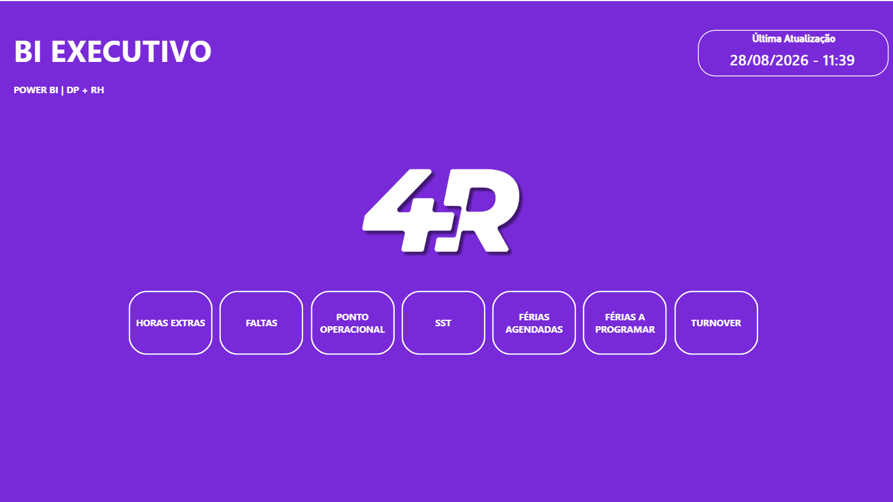
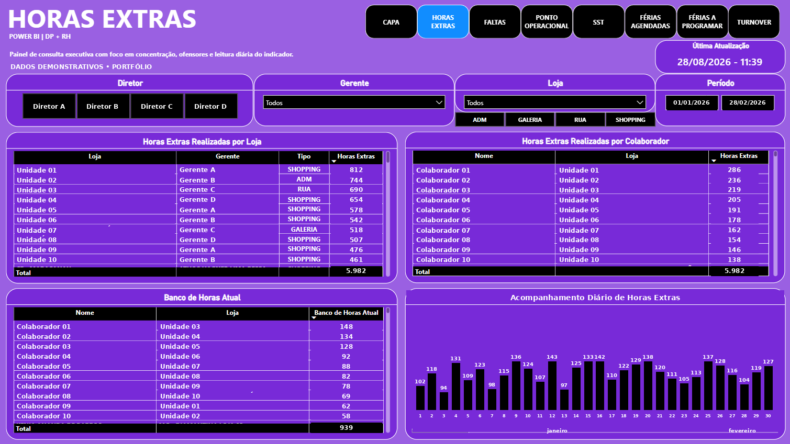
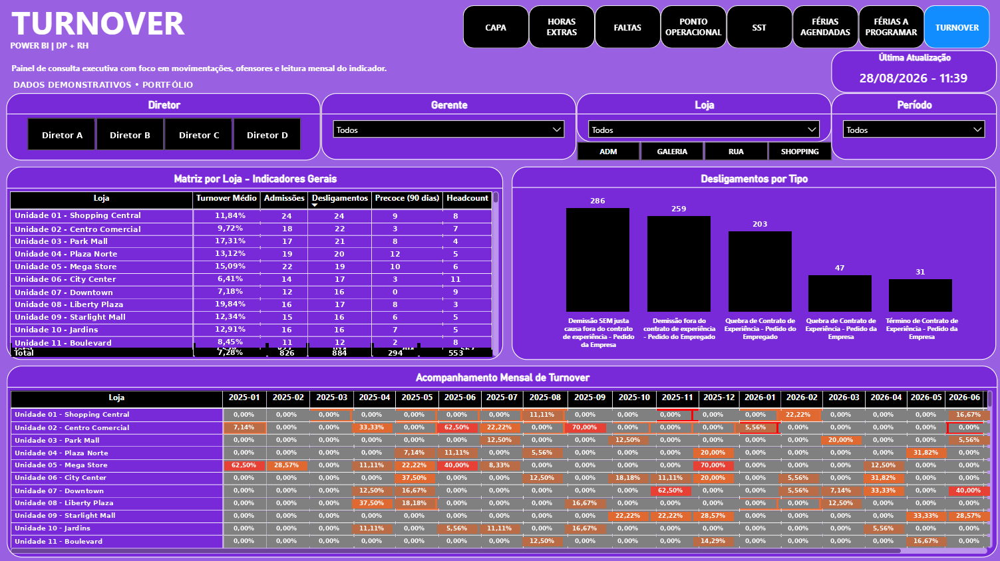

# 📊 BI Executivo DP/RH

> Business Intelligence aplicado ao Departamento Pessoal e RH, utilizando **Python, APIs e Power BI** para transformar dados operacionais em informações para acompanhamento e tomada de decisão.

---

## 🎯 Sobre o projeto

O **BI Executivo DP/RH** foi desenvolvido para centralizar e estruturar indicadores que antes dependiam de consultas em diferentes sistemas e controles operacionais.

A solução utiliza **Python e APIs** para coleta, tratamento e organização dos dados, gerando bases analíticas consumidas pelo **Power BI**.

O objetivo é reduzir etapas manuais, melhorar a confiabilidade das informações e facilitar o acompanhamento dos principais indicadores de DP/RH.

> Este repositório representa uma **versão de portfólio** do projeto.  
> Dados, credenciais, endpoints e informações internas foram removidos ou substituídos por exemplos fictícios.

---

## 🖥️ Dashboard Preview

### Visão Geral



### Horas Extras

Painel de acompanhamento de horas extras, banco de horas e evolução diária do indicador.  
Os dados exibidos nesta versão são demonstrativos e foram preparados exclusivamente para portfólio.



### Turnover

Visão executiva dos indicadores de desligamento, turnover por unidade e acompanhamento mensal.  
Os dados exibidos nesta versão são demonstrativos e não representam informações reais da operação.



---

## 📌 Indicadores contemplados

O BI possui análises relacionadas a:

- ⏱️ Horas Extras
- 📅 Faltas e Ausências
- 🕒 Ponto Operacional
- 🦺 Saúde e Segurança do Trabalho — SST
- 🏖️ Férias Programadas
- 📆 Férias a Programar
- 🔄 Turnover

---

## 🏗️ Arquitetura

Fluxo simplificado da solução:

```text
Sistemas de DP/RH
        │
        ▼
      APIs
        │
        ▼
     Python
        │
        ├── Extração
        ├── Tratamento
        ├── Validação
        └── Regras de negócio
        │
        ▼
 Bases Analíticas
     Parquet
        │
        ▼
    Power BI
        │
        ▼
Dashboards e Indicadores
```

O **Python concentra a maior parte da transformação e aplicação das regras de negócio**, enquanto o Power BI é utilizado principalmente como camada de análise e visualização.

---

## 🛠️ Tecnologias


---

## ⚙️ Pipeline de dados

O processo foi estruturado em etapas:

1. **Extração** dos dados por meio de APIs;
2. **Normalização** das diferentes fontes;
3. Aplicação das **regras de negócio de DP/RH**;
4. Validação e tratamento das informações;
5. Geração das bases analíticas;
6. Armazenamento em formato **Parquet**;
7. Consumo das informações pelo **Power BI**;
8. Atualização dos indicadores e dashboards.

---

## 📊 Estrutura do BI

O projeto foi organizado em diferentes páginas analíticas:

```text
📊 BI Executivo DP/RH
│
├── 🏠 Visão Geral
├── ⏱️ Horas Extras
├── 📅 Faltas / Ausências
├── 🕒 Ponto Operacional
├── 🦺 SST
├── 🏖️ Férias Programadas
├── 📆 Férias a Programar
└── 🔄 Turnover
```

Cada módulo possui regras específicas de tratamento e análise.

---

## 💡 Decisões do projeto

Algumas decisões importantes adotadas durante o desenvolvimento:

- Utilizar **Python como principal camada de transformação**;
- Evitar concentração excessiva de regras de negócio dentro do Power BI;
- Separar coleta, transformação e visualização;
- Criar bases analíticas reutilizáveis;
- Priorizar rastreabilidade e consistência dos dados;
- Estruturar o projeto para permitir evolução incremental dos módulos.

---

## 📁 Estrutura do repositório

```text
bi-executivo-dp-rh/
│
├── docs/
│   ├── arquitetura.md
│   └── imagens/
│
├── src/
│   ├── extract/
│   ├── transform/
│   └── load/
│
├── sample_data/
│   └── dados_ficticios/
│
├── powerbi/
│   └── README.md
│
├── .gitignore
├── requirements.txt
└── README.md
```

---

## 🔐 Segurança e privacidade

Por se tratar de uma solução aplicada a processos de Departamento Pessoal e RH:

- nenhum dado real de colaborador é disponibilizado;
- credenciais e tokens de APIs não fazem parte do repositório;
- endpoints privados foram removidos;
- dados de exemplo são fictícios ou anonimizados;
- arquivos utilizados em produção não são publicados.

---

## 🚧 Status

O projeto continua evoluindo com novos indicadores, melhorias no pipeline e aperfeiçoamento das regras de negócio.

Este repositório tem finalidade de **documentação técnica e apresentação de portfólio**.

---

## 👨‍💻 Autor

**Danilo Pereira Emilio**

Departamento Pessoal | Dados e Automação

[](https://www.linkedin.com/in/danilo-pereira-emilio/)
